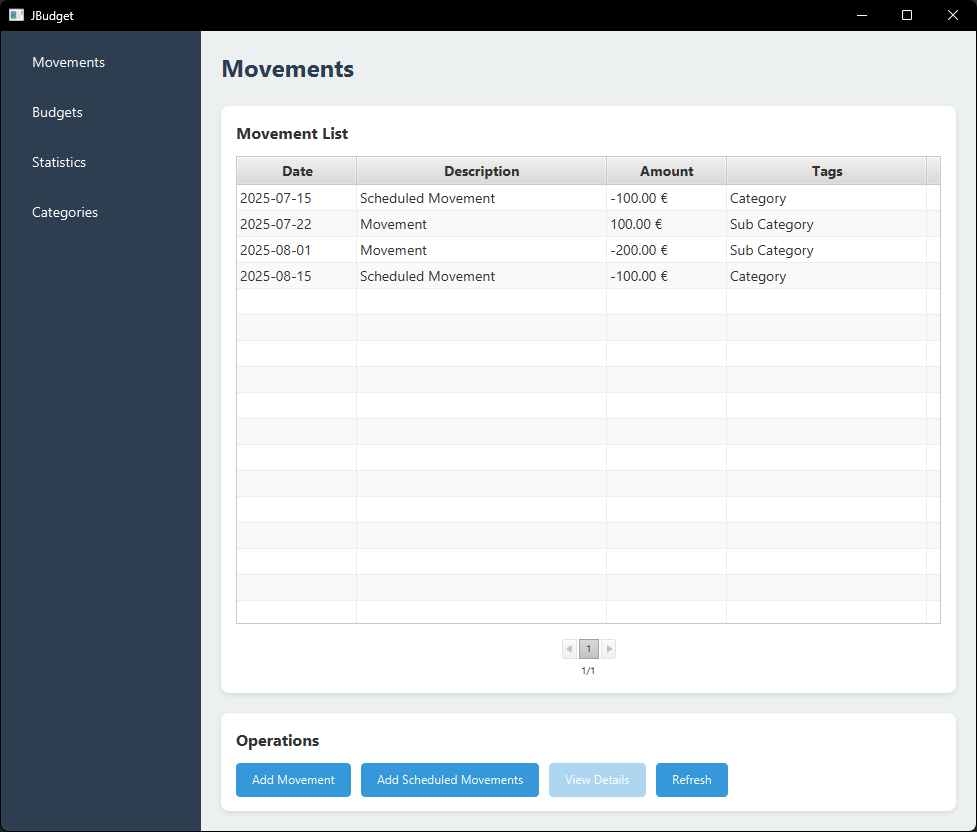
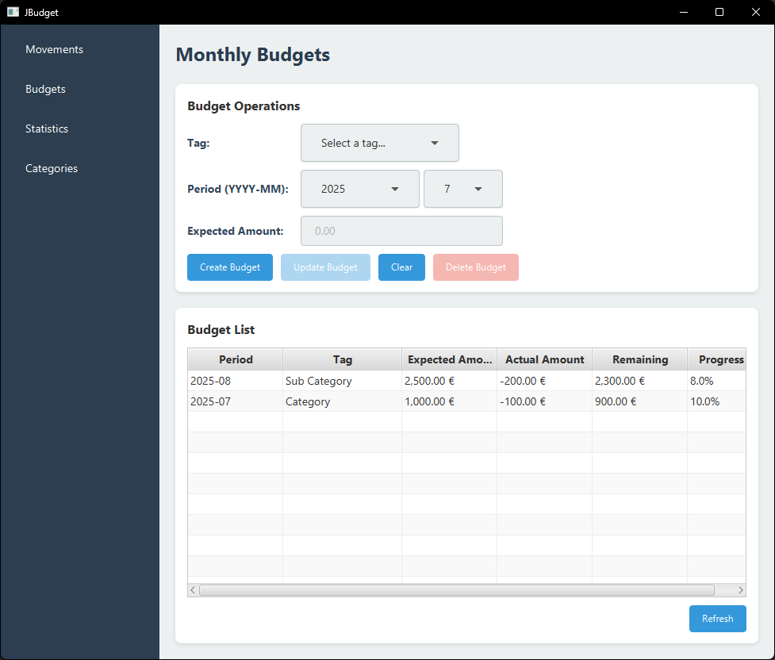
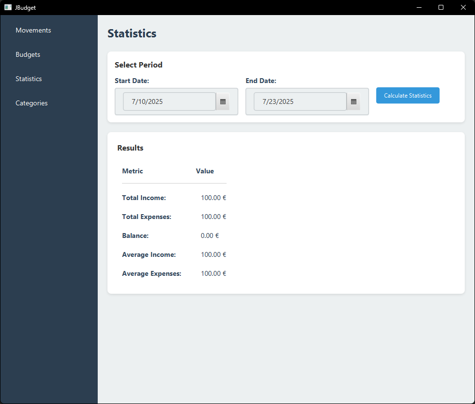

# JBudget - Family Budget Management

## Project Description

JBudget is a Java application designed for family budget management, developed as a project for the Advanced Programming course. The application allows users to track expenses and plan future projects considering expected income.

## Main Features

### 🏷️ Movement Management
- **Movement insertion and consultation**: Ability to record all financial movements
- **Hierarchical tag system**: Transaction categorization with tags organized in hierarchical structure (Sports, Utilities, Car Maintenance, etc.)
- **Scheduled Movements**: Insertion of future movements for specific dates

### 💰 Budget Management
- **Family budget configuration**: Setting up expenses and income by period and category
- **Periodic monitoring**: Financial trend control over time
- **Tag-based organization**: Budget management divided by customizable categories

### 📅 Schedule Management
- **Deadline management**: Insertion and monitoring of future expenses
- **Automatic reminders**: Notification system for upcoming deadlines

### 📊 Statistics and Reports
- **Trend analysis**: Data processing for family budget monitoring
- **Time comparisons**: Comparison between different time periods
- **Category analysis**: Detailed statistics for each type of expense

## System Architecture

The application has been designed following SOLID principles and design patterns to ensure:

- **Extensibility**: Easy addition of new features
- **Modularity**: Clear separation of responsibilities
- **Multi-platform**: Future support for mobile, and web applications
- **Synchronization**: Ability to synchronize data between different devices

## Project Structure

```
src/
├── main/java/it/unicam/cs/mpgc/jbudget109164/
│   ├── model/           # Data model classes
│   ├── controller/      # Control logic
│   ├── view/            # User interface
│   ├── service/         # Services and business logic
│   ├── repository/      # Persistance
│   ├── util/            # Utility and helper classes
|   └── ...
├── test/java/           # Unit tests
└── resources/           # Application resources
```

## Technical Requirements

- **Java**: JDK 21
- **Build Tool**: Gradle
- **Testing**: JUnit for unit testing
- **Architecture**: Layered architecture with MVC pattern for separation of concerns

## Installation and Setup

### Prerequisites
- Java JDK 21
- Gradle

### Build
```bash
# Clone the repository
git clone <repository-url>
cd jbudget

# Build the project
./gradlew build

# Run tests
./gradlew test

# Start the application
./gradlew run
```

## Testing

The project includes a comprehensive unit test suite covering:
- Business logic of main classes
- Input data validation
- Service behavior
- Component integration

To run tests:
```bash
./gradlew test --info
```

## Applied Design Principles

### SOLID Principles
- **Single Responsibility**: Each class has a specific responsibility
- **Open/Closed**: Open for extensions, closed for modifications
- **Liskov Substitution**: Implementation substitutability
- **Interface Segregation**: Specific and focused interfaces
- **Dependency Inversion**: Dependency on abstractions, not concrete implementations

### Design Patterns Used
- **MVC (Model-View-Controller)**: Separation of presentation logic
- **Observer Pattern**: For event management
- **Strategy Pattern**: For interchangeable calculation algorithms
- **Factory Pattern**: For creating complex objects
- **Repository Pattern**: For data access abstraction

## Future Extensibility

The modular architecture easily allows:
- Addition of new transaction types
- Implementation of new calculation algorithms
- Integration with external services (banks, financial APIs)
- Development of interfaces for different platforms
- Implementation of cloud synchronization features

## Main Class Structure

### Model
- **Movement**: Represents a financial transaction
- **Tag**: Hierarchical categorization system
- **Budget**: Budget management by period and category
- **Statistics**: Represents a model for handle statistics information

### Controller
- **MovementController**: Transaction operations management
- **BudgetController**: Budget control
- **StatisticsController**: Statistics processing

### Service
- **MovementService**: Business logic for transactions
- **BudgetService**: Budget management logic
- **StatisticsService**: Report and statistics generation

## Technical Documentation

For more implementation details, refer to:
- Javadoc of main classes
- Test cases for usage examples

## Contributions

The project was developed following the Advanced Programming course specifications, with particular attention to:
- Code quality and style
- Algorithm efficiency
- Test coverage
- Complete documentation

**Note**: This project represents a prototype developed for educational purposes.

## Screenshots

### Movement Management

*Transaction list with filtering and categorization options*

### Budget Overview

*Budget configuration and monitoring interface*

### Statistics and Reports

*Detailed statistics with charts and trend analysis*

## 👨‍💻 License and Author

This project is licensed under the **MIT License**.  
See the [LICENSE](./LICENSE) file for more information.

**Author:** Michele Cianni

**University Course:** Advanced Programming – 2024/25

**University:** University of Camerino

**Email:** michele.cianni@studenti.unicam.it
